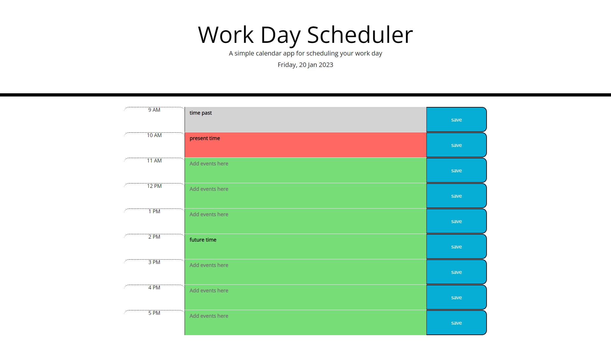

# jquery Day-Scheduler

This application is to show my ability to make a day scheduler using jquery, the time blocks are working hours between 9 am and 5 pm, and the colors will change dynamically, grey for time past, green for a future time and red for the present time.
The user inputs tasks during working hours, once the saved button is pressed the input is saved to local storage.
The inputs are saved in local storage along with the day the input was made, so if the user were to use it daily, the inputs from the previous days will not show on the following day, so the user has a clean slate every day but previous days are saved in local storage.

## link to the deployed application 

https://marcahudson26.github.io/refactored-spoon-Work-Day-Scheduler/

## screenshot of the working application

